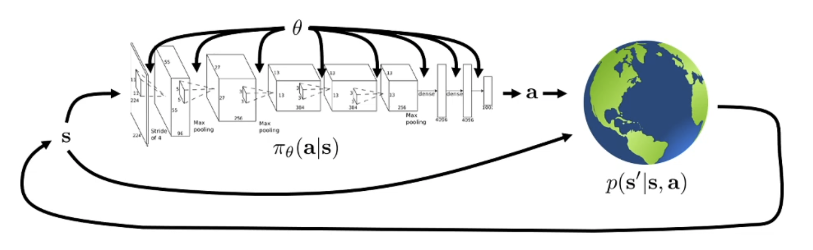

# The goal of reinforcement learning

trajectory distribution:

$$ p_{\theta} (s_{1}, a_{1}, ..., s_{T}, a_{T}) = p(s_{1}) \prod\limits_{t=1}^{T} \pi_\theta(a_t | s_{t}) p(s_{t+1}|s_{t},a_{t}) $$

$p_\theta (\tau)$ is a shorthand for this.

objective of RL:

$$\theta^{*} = arg\max_{\theta} E_{\tau \sim p_\theta}\left[\sum\limits_{t}r(s_{t}, a_{t})\right]$$

we can push the sum out of the expectation by the linearity of the expectations:

$$\theta^{*} = arg\max_{\theta} \sum\limits_{t=1}^{T}\left[E_{(s_t,a_t) \sim p_\theta}r(s_{t}, a_{t})\right]$$

(finite horizon case)

# Evaluating the objective

$J(\theta)$ is a shorthand of the expected sum of rewards.

**Question**: Without knowing $p(s_{1})$ and $p(s_{t+1} \| s_{t})$ , how can we estimate $J(\theta)$ ?

*Answer*: We can estimate this quantity by taking rollouts of our policy. $$\frac{1}{N} \sum\limits_{i} \sum\limits_{t} r(s_{i,t}, a_{i,t})$$
This is an "unbiased" estimate of the $J(\theta)$.

We want to improve the objective, not just estimate it. How can we estimate its derivative?

# Direct policy differentiation

$$J(\theta) = E_{\tau \sim p_\theta(\tau)}\left[ r(\tau)\right]$$

we can expand this expectation

$$= \int p_{\theta}(\tau)r(\tau)d\tau$$

Then, the derivative of this expression is,

$$\nabla_{\theta}J(\theta) =  \int \nabla_\theta p_{\theta}(\tau)r(\tau)d\tau$$

This doesn't give us a practical way to differentiate $p_\theta(\tau)$. Since we would need to differentiate unknown initial state and state transition probabilities.

But there is a useful **identity** that can allow us to do that..

> **Useful identity**
> This identity comes simply from the derivation rules of logarithm.
> $$p_\theta(\tau)\nabla \log p_\theta(\tau) = p_{\theta}(\tau) \frac{\nabla p_\theta(\tau)}{p_\theta(\tau)} = \nabla p_\theta(\tau)$$
> We can apply this in reverse to the equation on top.

It becomes,

$$\nabla_\theta J(\theta)  = \int p_\theta(\tau)\nabla \log p_\theta(\tau) r(\tau)d\tau$$

One clever thing here is we can write this as an expectation because it is an integral that has a $p_\theta(\tau)$ term.

$$= E_{\tau \sim p_\theta(\tau)} \left[ \nabla \log p_\theta(\tau) r(\tau) \right]$$

We are on the right track. We can estimate expectations by only using samples. However, we still cannot differentiate the $\nabla \log p_\theta(\tau)$ term. Let's work on that a bit more.

Let's bring up the definition of $p_\theta(\tau)$:

$$p_{\theta}(\tau) =  p_{\theta} (s_{1}, a_{1}, ..., s_{T}, a_{T}) = p(s_{1}) \prod\limits_{t=1}^{T} \pi_\theta(a_t | s_{t}) p(s_{t+1}|s_{t},a_{t})$$

Taking the $\log$ of both sides gives us:

$$\log p_\theta(\tau) = \log p(s_{1}) +  \sum\limits\limits_{t=1}^{T} \log \pi_\theta(a_t | s_{t}) + \log p(s_{t+1}|s_{t},a_{t})$$

Note that the initial state distribution and the transition probabilities do not depend on $\theta$ at all! Therefore,

$$\nabla_{\theta} \log p_\theta(\tau) = \sum\limits_{t=1}^{T} \nabla_{\theta}\log \pi_\theta(a_t | s_{t})$$

and

$$\nabla_\theta J(\theta) = E_{\tau\sim p_{\theta}}\left[\left(\sum\limits_{t=1}^{T} \nabla_{\theta}\log \pi_\theta(a_t | s_{t})\right) \left(\sum\limits_{t=1}^{T} r(s_{t}, a_{t}) \right) \right]$$

Everything in this expression is things we know! We can evaluate the policy and calculate the rewards. Therefore, we can use the earlier trick for evaluating the RL objective, run roll-outs and estimate this gradient:

$$\nabla_\theta J(\theta) \approx \frac{1}{N} \sum\limits_{i=1}^{N} \left(\sum\limits_{t=1}^{T} \nabla_{\theta}\log \pi_\theta(a_t | s_{t})\right) \left(\sum\limits_{t=1}^{T} r(s_{t}, a_{t}) \right) $$

and take a gradient update to improve the policy:

$$\theta \leftarrow \theta + \alpha \nabla_{\theta}J(\theta)$$

This gives us the $\text{REINFORCE}$ algorithm:

1. Sample $\{\tau_{i}\}$ from the policy $\pi_\theta(a_{t}\|s_{t})$
2. Compute the policy gradient
3. Update the policy: $\theta \leftarrow \theta + \alpha \nabla_{\theta}J(\theta)$
4. Repeat

This is probably the simplest RL algorithm ever. But this implementation will not work very well. Let's see why.

# Understanding policy gradients

To understand how policy gradients work, let's compare this with the maximum likelihood objective for supervised learning. Let's say we want to do imitation learning and we want to maximize the log likelihood of actions in our training dataset.

*Policy gradient:*

$$\nabla_\theta J(\theta) \approx \frac{1}{N} \sum\limits_{i=1}^{N} \left(\sum\limits_{t=1}^{T} \nabla_{\theta}\log \pi_\theta(a_t | s_{t})\right) \left(\sum\limits_{t=1}^{T} r(s_{t}, a_{t}) \right)$$

*Maximum likelihood gradient:*

$$\nabla_\theta J(\theta) \approx \frac{1}{N} \sum\limits_{i=1}^{N} \left(\sum\limits_{t=1}^{T} \nabla_{\theta}\log \pi_\theta(a_t | s_{t})\right)$$

We can see that when doing maximum likelihood, we want to maximize **every** sample's log likelihood. However, for policy gradient, there is a multiplication with the total reward. This means bad samples may have their log likelihood decreased and good samples increased.

## Gaussian policies for continuous actions

#todo

# What is wrong with the policy gradient?

Let's say we got these 3 sample trajectories to compute the gradient of $J(\theta)$.  In this graph, blue curve shows the probability of each trajectory under this policy. Green bars show the rewards of the sample trajectories. In this case, the policy will try to mainly avoid the negative sample and move towards right:

If we add a constant to the samples, the policy should actually change the same way. If all of the rewards are added a constant, the optimal policy doesn't change. However, in this case, it will be a quite different change:

We can think of more pathological cases where for example, two good samples have reward=$0$, essentially not contributing anything to the gradient.

These problems are symptoms of one cause: **high variance**. Depending on any finite number of samples, the gradient estimate will change a lot and potentially cause the policy learning algorithm to never converge.

All of the advanced policy gradient algorithms try to find ways to decrease the variance of gradient estimates.

# Reducing Variance

### Causality
The variance of Policy gradient can be lowered by using a property of our universe, $Causality$.

$$\nabla_\theta J(\theta) \approx \frac{1}{N} \sum\limits_{i=1}^{N} \sum\limits_{t=1}^{T} \nabla_{\theta}\log \pi_\theta(a_t | s_{t}) \left(\sum\limits_{t'={t}}^{T} r(s_{t'}, a_{t'}) \right)$$

The rewards obtained before timestep $t$ cannot be changed by the action at timestep $t$. Therefore, instead of multiplying the policy gradient with the total reward, we can multiply it with **reward-to-go**, $\hat{Q}_{i,t}$. Showing this quantity with $Q$ might be peculiar, but in fact, this is the Q-function at $s_t$ given you choose $a_t$.

The reason this value has lower variance is very simple. It is a smaller number.

### Baseline
Intuitively, we thought of policy gradients as making good trajectories more likely and bad trajectories less likely. However, this is only true if the rewards are *centered*. So, what we can do is to remove a constant from the rewards of every trajectory:

$$\nabla_\theta J(\theta) \approx \frac{1}{N} \sum\limits_{i=1}^{N}\nabla_{\theta} \log p_\theta(\tau)\left[r(\tau)-b\right]$$

A good choice for this constant, or *baseline*, is the average reward:

$$b=\frac{1}{N}\sum\limits_{i=1}^{N} r(\tau)$$

This makes a lot of sense. We are literally centering the rewards. But are we allowed to do this?? Does the math work out?  It turns out that removing a constant value from rewards still keep the gradient estimate unbiased. The following is the new expectation we need to calculate for $J(\theta)$:

$$E_{\tau \sim p_\theta(\tau)} \left[ \nabla \log p_\theta(\tau) [r(\tau) -b] \right]$$

When we distribute $\nabla_{\theta}\log p_\theta(\tau)$, we get a new term subtracted from the original policy gradient:

$$E_{\tau \sim p_\theta(\tau)} \left[ \nabla \log p_\theta(\tau)b \right]$$

We can show this expectation is $0$ using the convenient identity from before $p_\theta(\tau)\nabla \log p_\theta(\tau) = \nabla_{\theta}p_{\theta}(\tau)$:

$$\begin{align*} \int &p_\theta(\tau)\nabla_{\theta}\log p_\theta(\tau)b d\tau\\
&=\int\nabla_{\theta}p_\theta(\tau) b d\tau\\
&=b\nabla_{\theta}\int p_\theta(\tau) d\tau\\
&=b\nabla_{\theta}1 \\
&= 0
\end{align*}$$

The baseline we used here is a pretty good baseline. However, we can derive the optimal baseline and it is not the average reward. Let's discuss this in the next section.

#todo TBC
