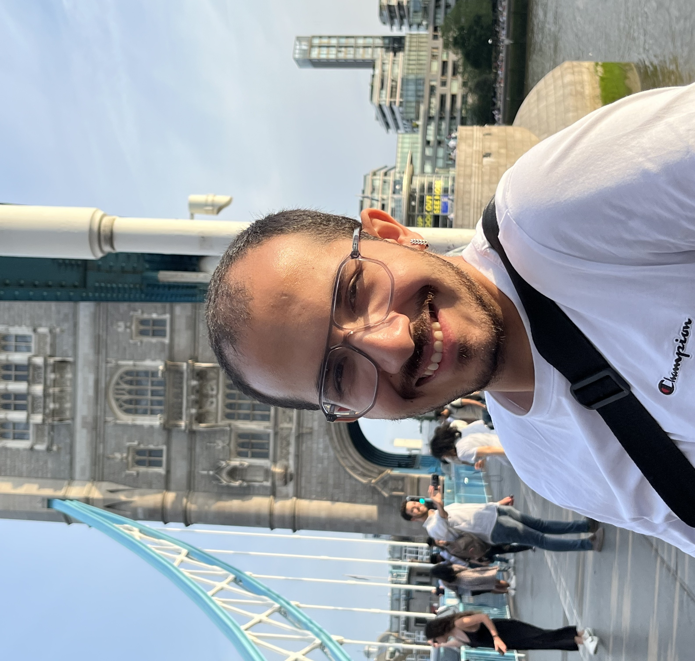

## Hello, I'm Enes

 

 

I am currently a founding research enginer at a stealth robotics startup.

Previously, I worked on mobile manipulator designs and tactile sensing with [Lerrel Pinto](https://www.lerrelpinto.com/) at NYU.

In my undergrad, I founded the Koc University AI and Robotics Society and led a team of 20 people to build a [self-driving vehicle](https://youtu.be/BU6hqeaTKyg) from scratch. I also spent some time at [Wayve](https://wayve.ai/) working on [scaling AV simulation](https://wayve.ai/thinking/introducing-wayve-infinity-simulator/) and building a [neural simulator](https://wayve.ai/thinking/ghost-gym-neural-simulator/).

## [Google Scholar](https://scholar.google.com/citations?user=pqU1r20AAAAJ&hl=en)

## Publications / Preprints
+ Cone-E: An Open Source Bimanual Mobile Manipulator for Generalizable Robotics\
**Enes Erciyes**, Haritheja Etukuru, Soumith Chintala, Nur Muhammad “Mahi” Shafiullah, Lerrel Pinto \
[[Website]](https://www.cone-e.com)

+ AnySkin: Plug-and-Play Skin Sensing for Robotic Touch\
 Raunaq Bhirangi, Venkatesh Pattabiraman, **Enes Erciyes**, Yifeng Cao, Tess Hellebrekers, Lerrel Pinto \
 ICRA 2025\
 [[Arxiv]](https://arxiv.org/abs/2409.08276) [[Website]](https://any-skin.github.io/)

<!-- ## Notes / ideas

+ [Policy gradients notes](./Policy-Gradient.html) -->
